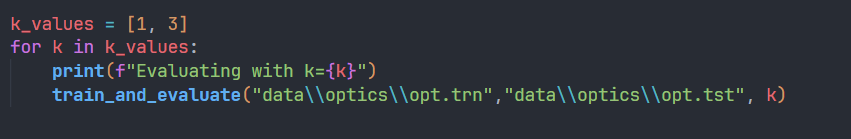
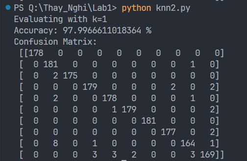
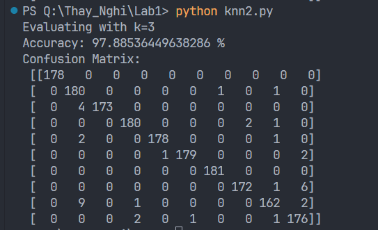
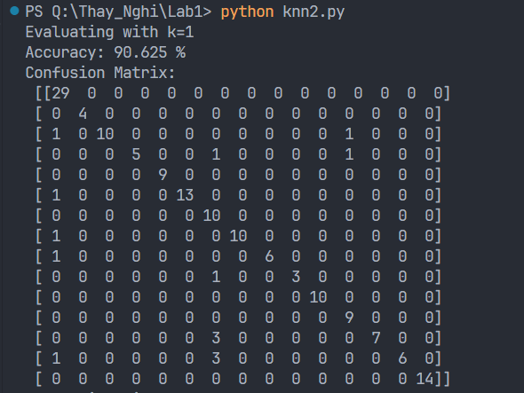
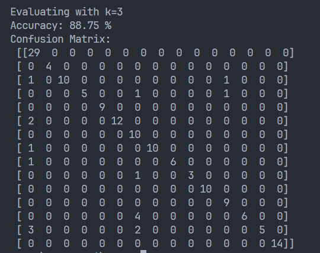

# k-nearest-neighbors

## Train project

Run knn2.py

#### IRIS Data

Result:

- k = 1
  
- k = 3
  

#### OPTICS Data

Result:

- k = 1
  
- k = 3
  

#### FP Data

Result:

- k = 1
  
- k = 3
  

#### Built With

- Numpy
- Pandas
- Sklearn
